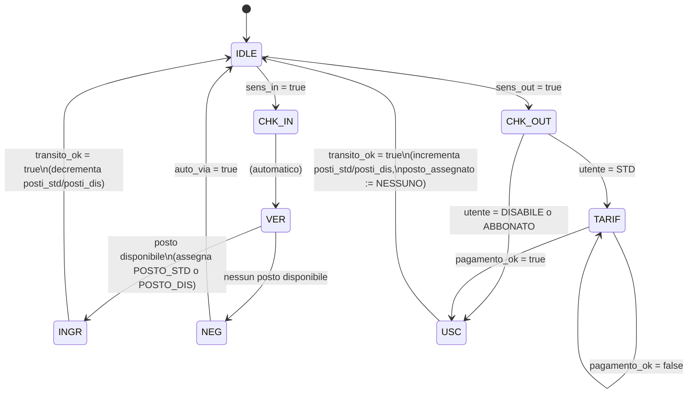

# 1. Requisiti — SmartParking

## 1.1 Descrizione del sistema

SmartParking è un sistema di gestione automatizzata per un parcheggio dotato di due sbarre
(una di ingresso e una di uscita), sensori di rilevamento veicolo e un totem per il
riconoscimento del tipo di utente. Il parcheggio dispone di due categorie di posti auto:
posti **standard** e posti riservati ai **disabili**, ciascuna con una capacità massima
configurabile (nel modello di riferimento, per semplicità, entrambe pari a 1).

Il sistema riconosce tre tipologie di utente: **STD** (utente occasionale, paga la
sosta), **DISABILE** (utente con permesso disabili, esente da pagamento, con priorità
sui posti riservati) e **ABBONATO** (utente con abbonamento mensile, esente da
pagamento). Quando un veicolo si presenta alla sbarra di ingresso, il sistema rileva la
richiesta tramite un sensore, identifica il tipo di utente e verifica la disponibilità di
un posto adeguato prima di sollevare la sbarra. Se non c'è posto disponibile, l'accesso
viene negato e il veicolo deve allontanarsi prima che il sistema torni operativo.

Un utente DISABILE ha diritto di priorità sui posti riservati: se questi sono esauriti,
il sistema applica una politica di *fallback* assegnandogli un posto standard, purché
disponibile. Se anche i posti standard sono esauriti, l'accesso viene comunque negato.

In uscita, il sistema rileva il veicolo con un secondo sensore e ne verifica nuovamente
il tipo. Solo gli utenti STD devono transitare per una fase di pagamento (tariffa) prima
che la sbarra di uscita si apra; ABBONATI e DISABILI sono esenti e procedono
direttamente all'uscita. Al transito effettivo del veicolo (in ingresso o in uscita), il
sistema aggiorna il conteggio dei posti liberi della categoria corrispondente a quella
effettivamente assegnata.

Il comportamento del sistema è stato modellato formalmente in Abstract State Machine
(ASM) tramite Asmeta, come macchina a stati finiti con 8 stati operativi, e validato con
scenari di simulazione (Avalla) e proprietà di model checking (CTL).

## 1.2 Requisiti funzionali

| ID | Descrizione | Priorità |
|------|-------------|----------|
| RF1 | Il sistema deve rilevare l'arrivo di un veicolo in ingresso tramite il sensore `sens_in` e portare lo stato da IDLE a CHK_IN. | Alta |
| RF2 | Il sistema deve identificare il tipo di utente (STD, DISABILE, ABBONATO) e passare allo stato di verifica VER. | Alta |
| RF3 | Per un utente STD o ABBONATO, il sistema deve assegnare un posto standard (POSTO_STD) se `posti_std > 0` e aprire la sbarra (stato INGR). | Alta |
| RF4 | Per un utente DISABILE, il sistema deve assegnare in via prioritaria un posto disabile (POSTO_DIS) se `posti_dis > 0`. | Alta |
| RF5 | Se per un utente DISABILE i posti disabili sono esauriti (`posti_dis = 0`), il sistema deve tentare l'assegnazione di un posto standard come fallback, se disponibile. | Alta |
| RF6 | Se nessun posto è disponibile per la categoria di utente richiesta (inclusi i fallback), il sistema deve negare l'accesso (stato NEG). | Alta |
| RF7 | Da uno stato di accesso negato (NEG), il sistema deve tornare in IDLE solo dopo che il veicolo si è allontanato (`auto_via = true`). | Media |
| RF8 | Al transito effettivo del veicolo in ingresso (`transito_ok = true` in stato INGR), il sistema deve decrementare di 1 il contatore dei posti liberi corrispondenti al posto effettivamente assegnato e tornare in IDLE. | Alta |
| RF9 | Il sistema deve rilevare l'arrivo di un veicolo in uscita tramite il sensore `sens_out` e portare lo stato da IDLE a CHK_OUT. | Alta |
| RF10 | In uscita, per un utente STD il sistema deve richiedere il pagamento della tariffa (stato TARIF) prima di aprire la sbarra di uscita. | Alta |
| RF11 | In uscita, per un utente DISABILE o ABBONATO il sistema deve saltare la fase di pagamento e procedere direttamente allo stato USC. | Alta |
| RF12 | Lo stato TARIF deve permanere finché il pagamento non risulta confermato (`pagamento_ok = true`); solo allora si passa a USC. | Alta |
| RF13 | Al transito effettivo del veicolo in uscita (`transito_ok = true` in stato USC), il sistema deve incrementare di 1 il contatore dei posti liberi corrispondenti al posto assegnato, azzerare la memoria (`posto_assegnato := NESSUNO`) e tornare in IDLE. | Alta |
| RF14 | Il sistema deve mantenere in memoria (`posto_assegnato`) il tipo di posto effettivamente occupato da un veicolo dall'ingresso fino all'uscita, per garantire il corretto rilascio del contatore. | Media |

## 1.3 Requisiti non funzionali

| ID | Descrizione |
|------|-------------|
| RNF1 | **Sicurezza dei contatori**: i contatori `posti_std` e `posti_dis` non devono mai assumere valori negativi né superare la capacità massima iniziale, in ogni stato raggiungibile del sistema (proprietà verificata tramite model checking, vedi `docs/02_asmeta.md`). |
| RNF2 | **Determinismo**: a parità di stato corrente e di ingressi monitorati, il sistema deve produrre sempre lo stesso stato successivo e gli stessi aggiornamenti ai contatori (nessuna scelta non deterministica nelle regole di transizione). |
| RNF3 | **Assenza di stati bloccanti**: da ogni stato transitorio (NEG, INGR, CHK_OUT, TARIF, USC) deve esistere sempre un cammino che riporta il sistema in IDLE, dato un adeguato input dell'ambiente (liveness). |

## 1.4 Diagramma della macchina a stati

## 1.5 Glossario

| Termine | Significato |
|---------|-------------|
| **Sensore di ingresso (`sens_in`)** | Dispositivo che rileva la presenza di un veicolo davanti alla sbarra di ingresso. |
| **Sensore di uscita (`sens_out`)** | Dispositivo che rileva la presenza di un veicolo davanti alla sbarra di uscita. |
| **Sbarra** | Barriera fisica che consente o impedisce il transito del veicolo; si apre solo negli stati INGR e USC (quando `transito_ok = true`). |
| **Transito (`transito_ok`)** | Segnale che indica che il veicolo è effettivamente passato sotto la sbarra aperta. |
| **Tipo utente (`utente_rilevato`)** | Categoria del veicolo/conducente identificata dal sistema: STD, DISABILE o ABBONATO. |
| **Posto standard (`POSTO_STD`)** | Posto auto generico, soggetto a tariffa per utenti STD. |
| **Posto disabile (`POSTO_DIS`)** | Posto auto riservato, con priorità di assegnazione per utenti DISABILE. |
| **Posto assegnato (`posto_assegnato`)** | Memoria del tipo di posto occupato dal veicolo attualmente in transito, usata per il corretto rilascio in uscita. |
| **Fallback** | Politica per cui un utente DISABILE, in assenza di posti disabili liberi, riceve un posto standard se disponibile. |
| **Tariffa (`TARIF`)** | Fase di pagamento della sosta, obbligatoria solo per utenti STD in uscita. |
